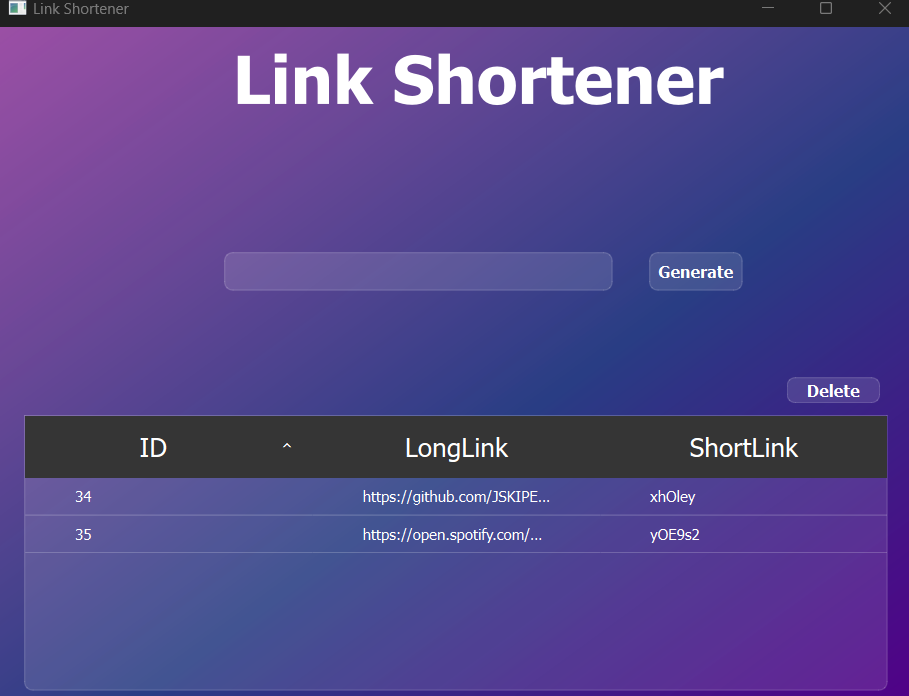

# URL Shortener with PySide6 & Flask
A simple desktop GUI application for shortening and managing URLs, with a Flask server for redirection.

## Table of Contents
- [Structure](#structure)
- [Features](#features)
- [Screenshots](#screenshots)
- [Installation](#installation)
- [Usage](#usage)
- [Technologies Used](#technologies-used)
- [License](#license)

## Structure
```bash
📁 url-shortener/
├── main.py                  # Entry point with PySide6 and Flask setup
├── flask_server.py          # Flask server with redirect route
├── connection.py            # Database handler using QtSql
├── ui_main.py               # Auto-generated UI from Qt Designer
├── links_db.db              # SQLite database (excluded with .gitignore)
├── requirements.txt         # Project dependencies
├── README.md                # Project documentation
├── .gitignore               # Git ignore rules
└── LICENSE
```
## Features
- Shorten any long URL
- Automatically generates a short code
- Store and view links in an SQLite database
- Flask server redirects short URLs to original links
- GUI built with PySide6

## Screenshots


## Installation

1. Clone the repository:
```bash
git clone https://github.com/JSKIPER/url-shortener.git
cd url-shortener
```
2. Create a virtual environment (optional but recommended):
```bash
python -m venv .venv
source .venv/bin/activate  # or .venv\Scripts\activate on Windows
```
3. Install the dependencies:
```bash
pip install -r requirements.txt
```


## Usage


1. Run the application: python main.py
2. Enter a long URL in the GUI and click "Generate Link".
3. The Flask server runs on http://localhost:5000/<short_code>, so you can open shortened links in a browser.


## Technologies Used

- Python 3.12
- PySide6 (GUI)
- Flask (server)
- SQLite (database)

## License

This project is licensed under the [MIT license](LICENSE)..
